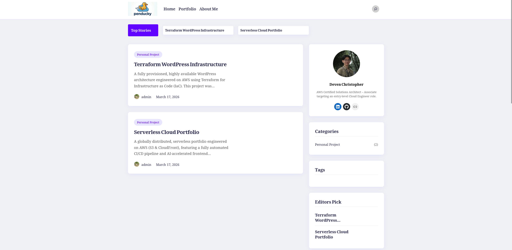
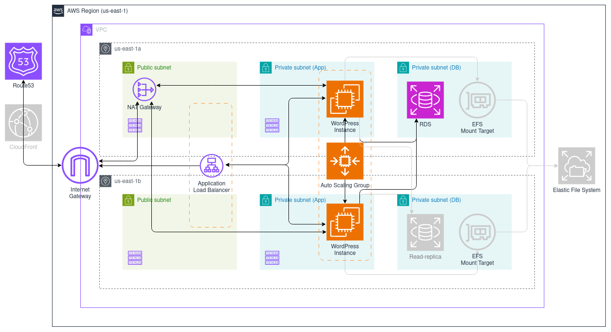

# Terraform-Managed Three-Tier WordPress Architecture ☁️


A fully provisioned, highly available Three-Tier WordPress architecture engineered on AWS using Terraform for Infrastructure as Code (IaC).

<div align="center">

</div>

### 🔗 [View Live Site](https://wordpress.penducky.click/wordpress)


Due to budget constraints, the website is not hosted 24/7.


---


## 🎯 Project Goal
This project was made to demonstrate hands-on IaC skills using Terraform and AWS infrastructure to provision a scalable server environment capable of hosting a functioning WordPress site, one of the most popular content management systems on the internet. That's why I write everything here by myself, without following any tutorial.

## 🏗️ Architecture & Engineering Decisions
The infrastructure is designed for high availability, security, and automated scaling.



*Resources marked with grey color is not defined in the code due to the cost reason. Instead, it is listed as a future improvements.

### 1.  State Locking: Simple Storage Service (S3)
Stores the state as a given key in a given bucket on Amazon S3 to prevent others from acquiring the lock and potentially corrupting the state.


### 2.  Compute: Elastic Compute Cloud (EC2)
**EC2** is utilized instead of **Lambda** because WordPress requires a persistent PHP runtime environment.

### 3.  Scaling: Auto Scaling Group (ASG)
The ASG automatically scales the number of EC2 instances up or down based on traffic demands.

### 4.  Traffic Distribution: Application Load Balancer (ALB)
The **ALB** distributes incoming HTTP/HTTPS traffic across the **EC2** instances provisioned by **ASG** to maintain performance and availability. The traffic flow routes from the internet to the load balancer, then to the app servers (EC2), and finally to the database (RDS).

### 5.  Database: Relational Database (RDS)
**Amazon RDS running MySQL** is used instead of self-hosting a database directly on an **EC2** instance to offloads maintenance responsibilities such as provisioning and automated backups.


## 🛠️ Tech Stack & Tools

* **Infrastructure as Code:** Terraform v1.14.6
* **Cloud Provider:** AWS (VPC, EC2, RDS, ALB, ASG, NAT Gateway, Internet Gateway)
* **Server Environment:** Ubuntu OS, Apache Web Server, MySQL Database


## 🚀 Future Improvements

A conscious decision was made to exclude the following paid services to prioritize a cost-efficient learning environment. With an allocated budget for a real production environment, these services would be crucial. These resources are marked with grey color on the architecture diagram shown above.

- [ ]  **Shared Storage:** Deploy **Amazon Elastic File System (EFS)** for shared storage across multiple EC2 instances to ensure media uploads and themes remain consistent and accessible, regardless of which instance serves the request. For this demonstration project, I keep 'one' instance as the ASG's desired capacity to minimize the cost, therefore shared storage is unnecessary.
- [ ]  **Multi-AZ Database:** Configure **Relational Database (RDS)** to use multi-AZ instead of single-AZ for disaster recovery and fault tolerance. To minimize the cost of this demonstration project, I keep the RDS in a single-AZ since there is no important data stored, and data-loss is not a problem.
- [ ]  **Content Delivery:** Deploy **CloudFront** in front of the ALB to cache static assets at edge locations, reducing latency and EC2 load.
- [ ]  **Redundant NAT Gateways:** Provision a NAT Gateway in each Availability Zone to prevent a single-AZ failure from severing outbound internet access for EC2 instances in healthy subnets.

## 📂 Project Structure

```text
.
├── .github
│   ├── assets
│   └── workflows
│       ├── icons
│       └── projects
├── modules
│   ├── app
│   │   ├── main.tf
│   │   ├── sg.tf
│   │   ├── variables.tf
│   │   └── user_data.tftpl
│   └── infra
│       ├── main.tf
│       ├── outputs.tf
│       └── variables.tf
├── main.tf
├── variables.tf
├── backend.tf
└── README.md